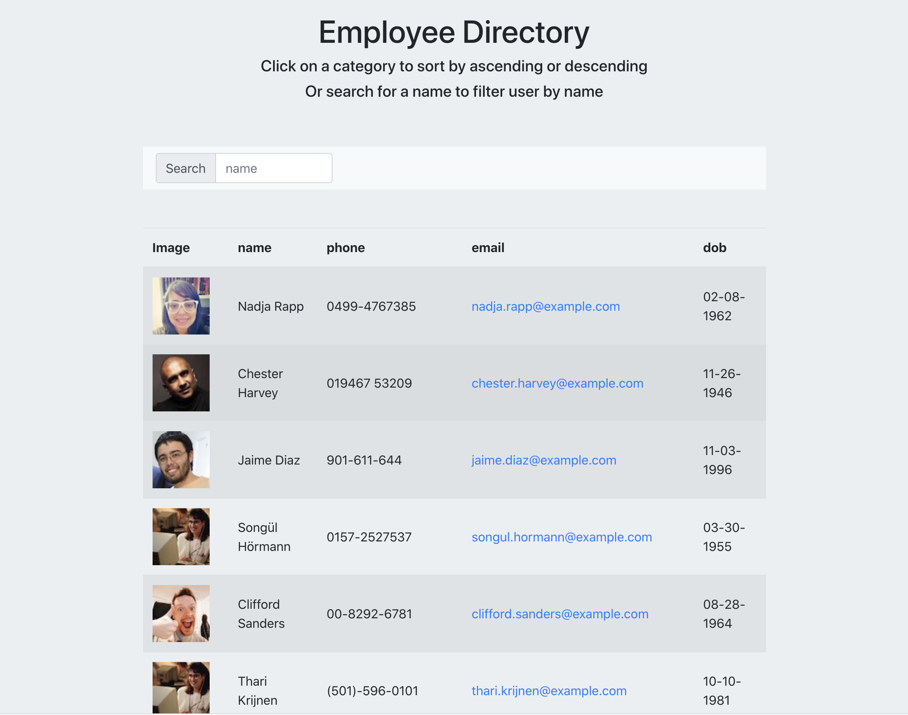

<h1 align="center">
Employee Directory
</h1>
<h4 align="center" style="margin-bottom:10px">Be sure to star my configuration repo so you can keep up to date on any daily progress!</h4>

  <h4>
    </a>
    
    
        
</h4>
 

This is an employee directory application.

  <h4>
    <a href="https://github.com/adbergen/employee-directory">
      Github Repository
    </a>
 | 
<a href="https://adbergen.github.io/employee-directory/">
      Github Pages
    </a>
  </h4>

## Table of Contents

- [Installation](#installation)
- [Usage](#usage)
- [Technologies](#technologies)
- [Contributing](#contributing)

## Installation

 
Using npm:

 
 

    npm install && npm start

## Usage

 This application is designed to allow an employee or manager to view an employee directory. When the user loads the page, a table of employees is displayed allowing the user to sort by name, phone, email, or dob. The user can also filter by name via the search field.

## Technologies

<ul>
<li>HTML, CSS, Bootstrap</li>
<li>React</li>
<li>Javascript, jQuery</li>
<li>node.js, Express, Axios</li>
<li>GitHub</li>
</ul>

## Contributing

- Pull requests are welcome. For major changes, please open an issue first to discuss what you would like to change.

- Contributors: Anthony Bergen

